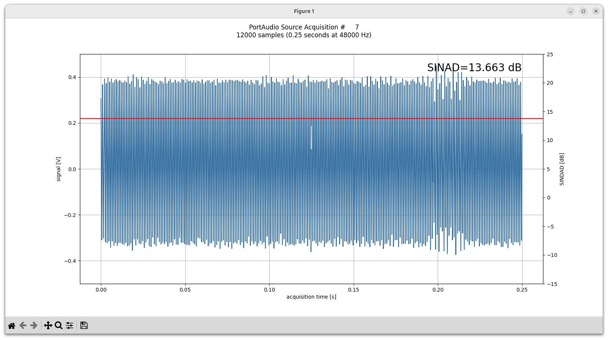
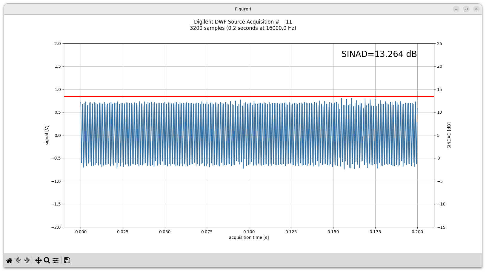
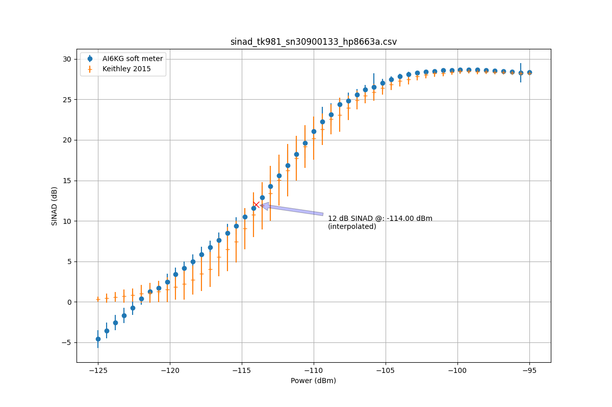
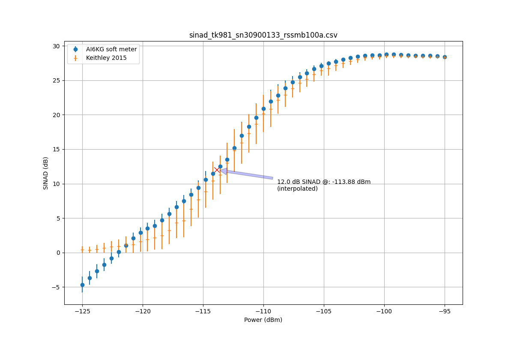

# Software SINAD meter

This is a software SINAD meter.  It display both the audio waveform
and the SINAD for the current acquisition window and a filtered SINAD
value as text.

Video (the synthesizer power ramps up power into receiver and the
SINAD subsquently increases): [Video](https://youtu.be/gy6IAjbTO2o)

The results match closely to a Keithley 2015 THD Multimeter, but the
this soft meter has a better noise floor even with a cheap audio card.

If you have an HP8663A (or probably HP866[23][AB]) or an R&S SMB100A,
the program can automatically do a SINAD sweep.  This is how the
graphs above were created.

For acquisition the code supports:
- bog-standard audio capture devices that PortAudio can talk to
- Digilent devices supported by pydwf (but only AD3 is known to work)

It has only been tested on Linux.  (It might work on Windoze; it might not.)

73 DE AI6KG 
Christopher Hoover 
Mountain View, California

