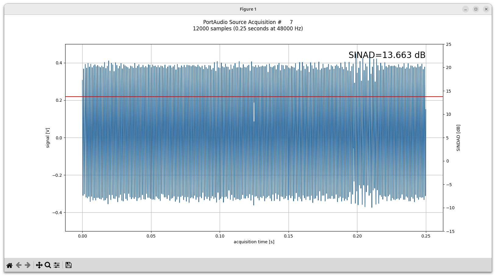
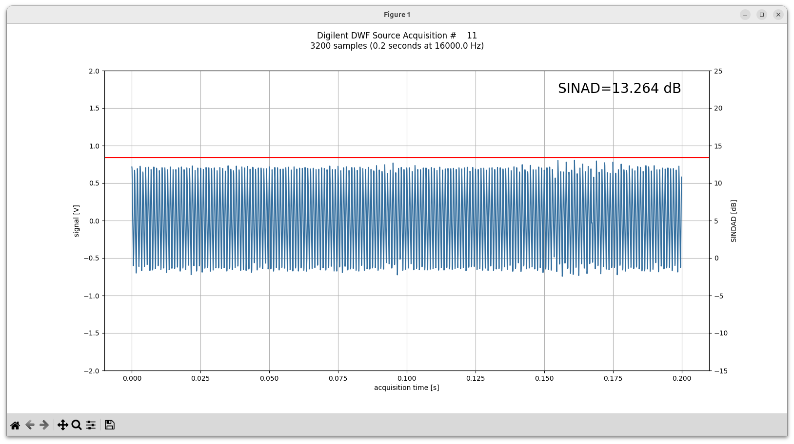
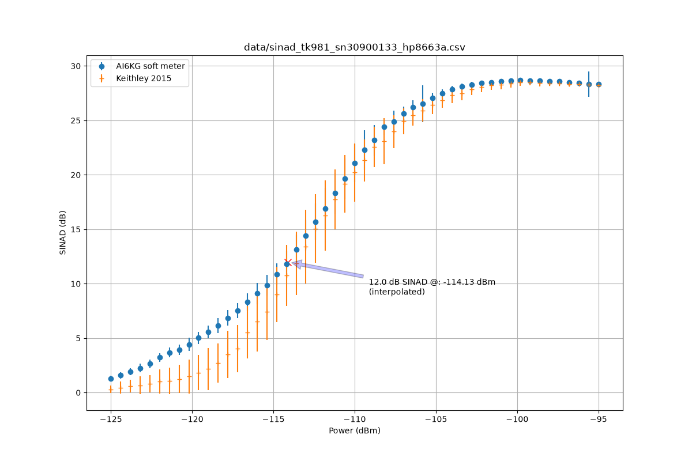
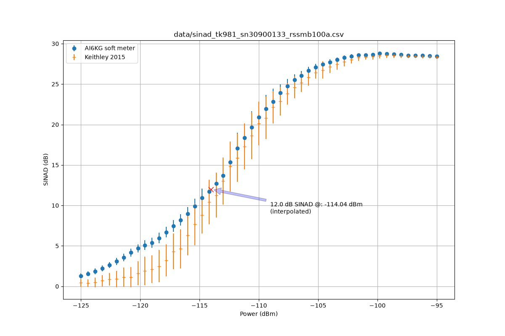

# Software SINAD meter

This is a software SINAD meter.  It display both the audio waveform
and the SINAD for the current acquisition window and a filtered SINAD
value as text.




Video (the synthesizer power ramps up power into receiver and the
SINAD subsquently increases): [Video](https://youtu.be/gy6IAjbTO2o)

## Performance

The results match reasonably to a Keithley 2015 THD Multimeter.




Note that the plotting script annotates the graph with the standard
12 dB SINAD point.

## Synthesizer Control

If you have an HP8663A (or probably HP866[23][AB]) or an R&S SMB100A,
the program can automatically do a SINAD sweep.  This is how the
graphs above were created.

## Receiver Audio Acquisition

For acquisition the code supports:
- bog-standard audio capture devices that PortAudio can talk to
- Digilent devices supported by pydwf (but only AD3 is known to work)


## Running

Dependencies are managed with [uv](https://docs.astral.sh/uv/).  The
instrument drivers come from a submodule, so clone recursively:

```
git clone --recurse-submodules https://github.com/charlieh0tel/sinad_meter.git
```

(For an existing clone, `git submodule update --init`.)

The environment is created on demand, so there is nothing to install
first:

```
uv run ./sinad_meter.py
```

`uv run` works for the other scripts here too, e.g. `uv run ./auto_sinad.py`.

It mainly has been tested on Linux.  It appears to run on Windoze fine.

73 DE AI6KG<br />
Christopher Hoover<br />
Mountain View, California

